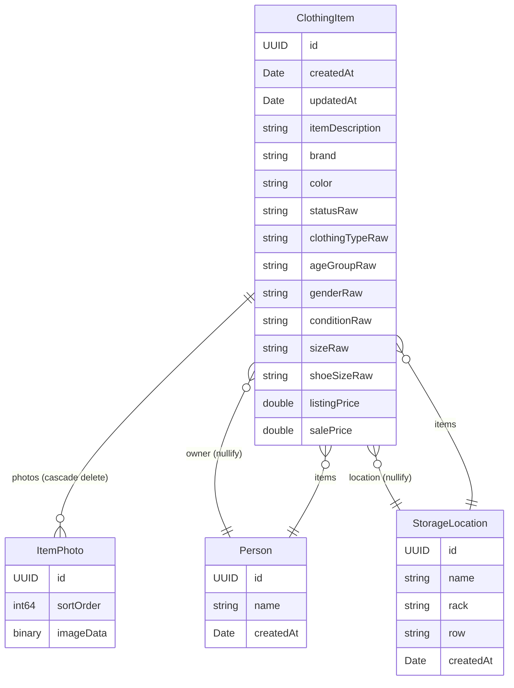
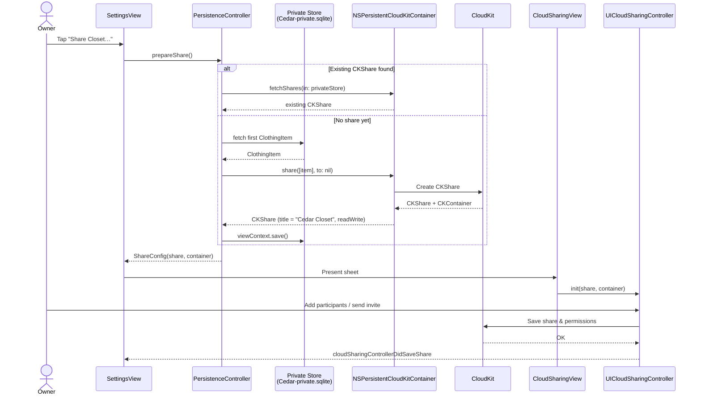
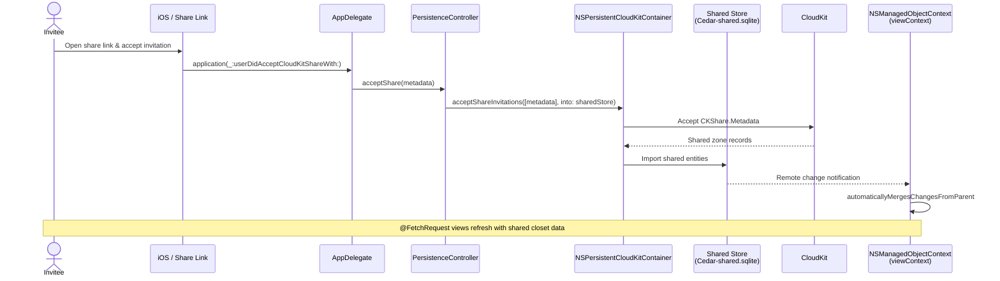

# Cedar Architecture

This document maps how Cedar Closet Manager is structured: entry points, navigation, data model, persistence, and external integrations.

## Overview

Cedar is a single-target SwiftUI app. All source lives under `Rack/`. The app catalogs clothing items, assigns them to people and storage locations, tracks resale/donation workflows, optionally calls the Anthropic API for descriptions and pricing, and syncs data through CloudKit.

```
┌─────────────────────────────────────────────────────────────────┐
│                         CedarApp                                │
│  @main → injects managedObjectContext → ContentView             │
│  AppDelegate → accepts CloudKit share invitations               │
└───────────────────────────┬─────────────────────────────────────┘
                            │
              ┌─────────────┴─────────────┐
              │       ContentView         │
              │  iPhone: TabView          │
              │  iPad: NavigationSplitView│
              └─────────────┬─────────────┘
                            │
     ┌──────────┬───────────┼───────────┬──────────┐
     ▼          ▼           ▼           ▼          ▼
 Inventory   People     Locations    Settings   SplashScreen
  ListView    View         View         View       (overlay)
     │
     └──► ItemDetailView (add/edit item, photos, AI wands)
```

## App Entry & Navigation

| Component | Role |
|-----------|------|
| `CedarApp` | Creates the window, attaches `AppDelegate`, injects `PersistenceController.shared.viewContext` into the SwiftUI environment |
| `AppDelegate` | Handles `userDidAcceptCloudKitShareWith` and forwards metadata to `PersistenceController.acceptShare` |
| `ContentView` | Root shell; chooses layout by horizontal size class |
| `SplashScreenView` | Full-screen tartan splash on launch; dismisses via callback |

**iPhone (`compact` size class):** `TabView` with four tabs — Inventory, People, Locations, Settings.

**iPad (`regular` size class):** `NavigationSplitView` with a sidebar listing `AppSection` cases and a detail pane for the selected section.

On appear, `ContentView` assigns the SwiftUI `undoManager` to the Core Data view context, enabling system undo (including shake-to-undo on device).

## Data Model

The Core Data model is defined **programmatically** in `PersistenceController.makeModel()` — there is no `.xcdatamodeld` file in the repo.

### Entities & Relationships



### Typed Enums

Raw string fields on `ClothingItem` are exposed through typed computed properties backed by Swift enums in `Rack/Enums/`:

| Enum | Used for |
|------|----------|
| `ItemStatus` | Workflow state (Keep, For Sale, Listed, Sold, For Donation, Given Away) |
| `ClothingType` | Category (shirts, pants, shoes, etc.) |
| `ClothingSize` | Apparel sizes, grouped by age group |
| `ShoeSize` | Shoe sizes, grouped by category (baby/toddler, kids, women's, men's) |
| `AgeGroup` | Kid vs adult sizing context |
| `Gender` | Unisex / male / female |
| `ItemCondition` | Item condition rating |

**Price fields:** `listingPrice` serves double duty — "Listing Price" for sale workflow items and "Donation Value" for donation workflow items. `salePrice` is shown only when status is Sold.

## Persistence & Sync

`PersistenceController` is a singleton that owns an `NSPersistentCloudKitContainer`.

### Store Configurations

| Configuration | SQLite file | CloudKit scope | Purpose |
|---------------|-------------|----------------|---------|
| `Private` | `Cedar-private.sqlite` | `.private` (default) | Owner's closet data |
| `Shared` | `Cedar-shared.sqlite` | `.shared` | Data from accepted share invitations |

Both stores use container `iCloud.com.stevedaurora.cedar` with persistent history tracking and remote change notifications enabled. The view context merges automatically with `NSMergeByPropertyObjectTrumpMergePolicy`.

### CloudKit Sharing Flow

Sharing requires at least one `ClothingItem` in the private store. The share title is set to "Cedar Closet" with read-write public permission.

#### Creating a share (owner)



#### Accepting a share invitation (invitee)



After acceptance, shared items live in the **Shared** store configuration. The private store continues to hold the owner's personal data; both stores sync through the same CloudKit container (`iCloud.com.stevedaurora.cedar`).

## View Layer

### Inventory (`Views/Inventory/`)

| View | Responsibility |
|------|----------------|
| `InventoryListView` | `@FetchRequest` for items, people, locations; search; filter sheet (status, owner, location, age group); swipe-to-delete |
| `ItemDetailView` | Add/edit form with photos, classification, status/pricing, owner/location pickers; embeds `CameraView` |
| `ItemRowView` / `StatusBadge` | List row presentation |
| `FilterSheetView` / `FilterChip` | Filter UI and active filter chips |
| `CameraView` | `UIImagePickerController` wrapper for camera capture |
| `ItemDraft` | Mutable form state decoupled from Core Data during editing |

**Photo pipeline:** up to 5 images per item, stored as `ItemPhoto.imageData` with external binary storage. Photos can come from camera (`CameraView`) or library (`PhotosPicker`). On save, existing photos are replaced.

### People (`Views/People/`)

`PeopleView` — CRUD for `Person` entities. Shows item count per person. Items reference people via optional `owner` relationship.

### Locations (`Views/Locations/`)

`LocationsView` — list and delete storage locations.

`AddLocationView` — create location with name, rack, and row. Used from both Locations tab and inline in `ItemDetailView`.

### Settings (`Views/Settings/`)

`SettingsView` — Anthropic API key storage (`@AppStorage`), AI feature status, family sharing entry point, app version.

### Sharing (`Views/Sharing/`)

`CloudSharingView` — `UIViewControllerRepresentable` wrapper around `UICloudSharingController`.

## Services

### AIService (`Services/AIService.swift`)

Actor singleton that calls the Anthropic Messages API.

| Method | Input | Output |
|--------|-------|--------|
| `generateDescription(photoData:)` | Up to 3 JPEG-transcoded images | One-sentence resale description |
| `estimatePrice(...)` | Brand, type, condition, size, age group | Suggested Poshmark listing price (USD) |

API key is read from `UserDefaults` (`anthropic_api_key`). When empty, wand buttons in `ItemDetailView` are hidden. Images are resized to fit within 1568px before upload.

## Utilities

### CSVImporter (`Utilities/CSVImporter.swift`)

Parses CSV files and creates `ClothingItem` records in a given `NSManagedObjectContext`. Supports columns for description, brand, color, size, shoeSize, type, ageGroup, gender, condition, status, owner, rack, row, location, listingPrice, and salePrice.

**Not yet wired to UI** — no file picker or settings entry point exists.

## Key Data Flows

### Add / Edit Item

```
ItemDetailView (ItemDraft)
    → user fills form, attaches photos
    → optional: AIService.generateDescription / estimatePrice
    → save(): create or update ClothingItem
    → replace ItemPhoto children
    → managedObjectContext.save()
    → CloudKit syncs via NSPersistentCloudKitContainer
```

### Filter Inventory

```
InventoryListView
    → @FetchRequest loads all ClothingItem (sorted by updatedAt desc)
    → client-side filter by searchText + status + owner + location + ageGroup
    → FilterSheetView sets filter @State bindings
```

### Delete Item

```
InventoryListView.onDelete
    → managedObjectContext.delete(item)
    → save()
    → cascade deletes related ItemPhoto records
    → undo available via wired undoManager
```

## External Dependencies

| System | Usage |
|--------|-------|
| **CloudKit** | iCloud sync and family sharing (`iCloud.com.stevedaurora.cedar`) |
| **Anthropic API** | Optional AI descriptions and price estimation (user-provided key) |
| **PhotosUI** | Photo library selection |
| **UIKit** | Camera capture, CloudKit sharing controller |

## Build & Project Generation

- **XcodeGen** — `project.yml` generates `Cedar.xcodeproj`
- **Bundle ID** — `com.stevedaurora.cedar`
- **Display name** — Cedar Closet Manager (set in `Info.plist`)
- **Platforms** — iPhone, iPad, Mac Catalyst (`SUPPORTS_MACCATALYST: YES`)
- **Entitlements** — CloudKit container in `Rack/Cedar.entitlements`

## File Index

```
Rack/
├── App/
│   ├── CedarApp.swift
│   ├── AppDelegate.swift
│   └── ContentView.swift
├── Models/
│   ├── ClothingItem.swift
│   ├── Person.swift
│   ├── StorageLocation.swift
│   └── ItemPhoto.swift
├── Enums/
│   ├── AgeGroup.swift
│   ├── ClothingSize.swift
│   ├── ClothingType.swift
│   ├── Gender.swift
│   ├── ItemCondition.swift
│   ├── ItemStatus.swift
│   └── ShoeSize.swift
├── Persistence/
│   └── PersistenceController.swift
├── Views/
│   ├── Inventory/
│   │   ├── InventoryListView.swift
│   │   └── ItemDetailView.swift      # also contains CameraView, ItemDraft
│   ├── People/
│   │   └── PeopleView.swift
│   ├── Locations/
│   │   └── LocationsView.swift       # also contains AddLocationView
│   ├── Settings/
│   │   └── SettingsView.swift
│   ├── Sharing/
│   │   └── CloudSharingView.swift
│   └── SplashScreenView.swift        # also contains TartanView
├── Services/
│   └── AIService.swift
└── Utilities/
    └── CSVImporter.swift
```
