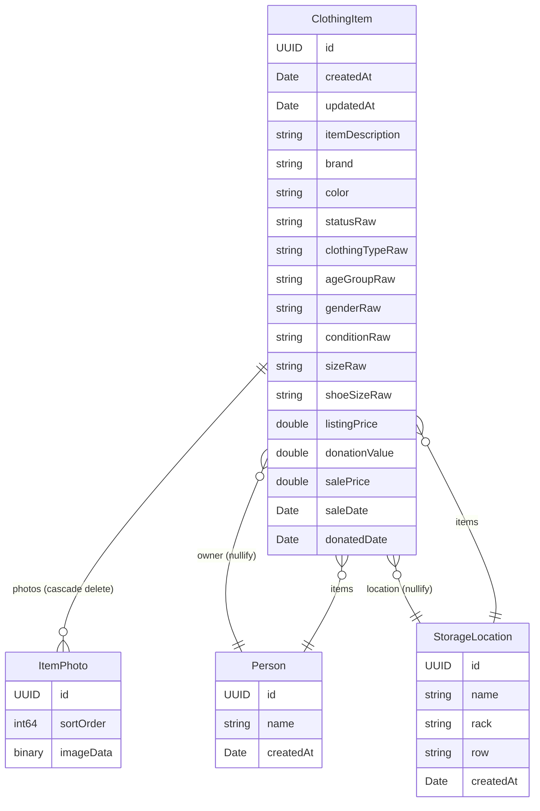
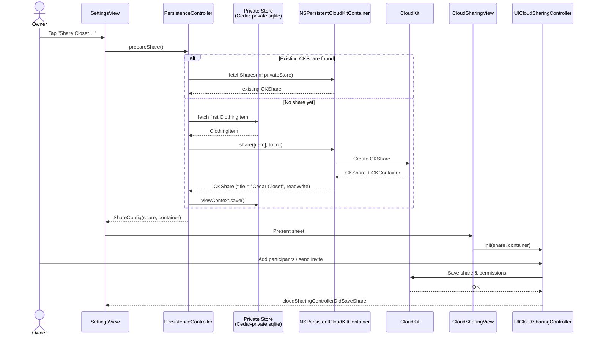
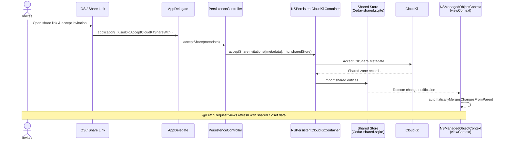

# Cedar Architecture

This document maps how Cedar Closet Manager is structured: entry points, navigation, data model, persistence, and external integrations.

For a short doc map and release checklist, see [Common/START_HERE.md](Common/START_HERE.md). For agent-oriented gotchas and account facts, see [Common/AI_ONBOARDING.md](Common/AI_ONBOARDING.md).

## Overview

Cedar is a single-target SwiftUI app. All source lives under `Rack/`. The app catalogs clothing items, assigns them to people and storage locations, tracks resale/donation workflows, optionally calls the Anthropic API for descriptions and pricing, and syncs data through CloudKit.

```
┌─────────────────────────────────────────────────────────────────┐
│                         CedarApp                                │
│  @main → injects managedObjectContext → ContentView             │
│  AppDelegate → accepts CloudKit share invitations               │
└───────────────────────────┬─────────────────────────────────────┘
                            │
              ┌─────────────┴─────────────┐
              │       ContentView         │
              │  iPhone: TabView          │
              │  iPad: NavigationSplitView│
              └─────────────┬─────────────┘
                            │
     ┌──────────┬───────────┼───────────┬──────────┐
     ▼          ▼           ▼           ▼          ▼
 Inventory   People     Locations    Settings   SplashScreen
  ListView    View         View         View       (overlay)
     │
     └──► ItemDetailView (add/edit item, photos, AI wands)
```

## App Entry & Navigation

| Component | Role |
|-----------|------|
| `CedarApp` | Creates the window, attaches `AppDelegate`, injects `PersistenceController.shared.viewContext` into the SwiftUI environment |
| `AppDelegate` | Handles `userDidAcceptCloudKitShareWith` and forwards metadata to `PersistenceController.acceptShare`; refreshes iCloud account status via `CloudKitSyncMonitor` at launch |
| `ContentView` | Root shell; chooses layout by horizontal size class |
| `SplashScreenView` | Full-screen tartan splash on launch; dismisses via callback |

**iPhone (`compact` size class):** `TabView` with four tabs — Inventory, People, Locations, Settings.

**iPad (`regular` size class):** `NavigationSplitView` with a sidebar listing `AppSection` cases and a detail pane for the selected section.

On appear, `ContentView` assigns the SwiftUI `undoManager` to the Core Data view context, enabling system undo (including shake-to-undo on device).

## Data Model

The Core Data model is defined **programmatically** in `PersistenceController.makeModel()` — there is no `.xcdatamodeld` file in the repo.

### Entities & Relationships


```mermaid
erDiagram
    ClothingItem ||--o{ ItemPhoto : "photos (cascade delete)"
    ClothingItem }o--|| Person : "owner (nullify)"
    ClothingItem }o--|| StorageLocation : "location (nullify)"
    Person ||--o{ ClothingItem : "items"
    StorageLocation ||--o{ ClothingItem : "items"

    ClothingItem {
        UUID id
        Date createdAt
        Date updatedAt
        string itemDescription
        string brand
        string color
        string statusRaw
        string clothingTypeRaw
        string ageGroupRaw
        string genderRaw
        string conditionRaw
        string sizeRaw
        string shoeSizeRaw
        double listingPrice
        double donationValue
        double salePrice
        Date saleDate
        Date donatedDate
    }

    ItemPhoto {
        UUID id
        int64 sortOrder
        binary imageData
    }

    Person {
        UUID id
        string name
        Date createdAt
    }

    StorageLocation {
        UUID id
        string name
        string rack
        string row
        Date createdAt
    }
```

### Typed Enums

Raw string fields on `ClothingItem` are exposed through typed computed properties backed by Swift enums in `Rack/Enums/`:

| Enum | Used for |
|------|----------|
| `ItemStatus` | Workflow state (Keep, For Sale, Listed, Sold, For Donation, Donated) |
| `ClothingType` | Category (shirts, pants, shoes, etc.) |
| `ClothingSize` | Apparel sizes, grouped by age group |
| `ShoeSize` | Shoe sizes, grouped by category (baby/toddler, kids, women's, men's) |
| `AgeGroup` | Kid vs adult sizing context |
| `Gender` | Unisex / male / female |
| `ItemCondition` | Item condition rating |

**Price fields:** `listingPrice` for the sale workflow (For Sale / Listed / Sold), `donationValue` for the donation workflow (For Donation / Donated), and `salePrice` when status is Sold. The two values are independent and are not copied when status changes.

**Lifecycle dates:** `saleDate` is set when status is Sold; `donatedDate` when status is Donated. Legacy `"Given Away"` status values are read as Donated.

## Persistence & Sync

`PersistenceController` is a singleton that owns an `NSPersistentCloudKitContainer`.

### Store Configurations

| Configuration | SQLite file | CloudKit scope | Purpose |
|---------------|-------------|----------------|---------|
| `Default` | `Cedar-private.sqlite` | `.private` (default) | Owner's closet data — **must use `Default`** to match SwiftData's CloudKit zone |
| `Shared` | `Cedar-shared.sqlite` | `.shared` | Data from accepted share invitations |

Both stores use container `iCloud.com.stevedaurora.cedar` with persistent history tracking and remote change notifications enabled. The view context merges automatically with `NSMergeByPropertyObjectTrumpMergePolicy`.

### CloudKit schema lifecycle

| Environment | Used by | How schema is updated |
|-------------|---------|------------------------|
| **Development** | Xcode Debug builds | `PersistenceController.initializeDevelopmentSchema()` (Settings → Developer, Debug only) — private store only; physical device recommended |
| **Production** | TestFlight / App Store | Deploy Development → Production in [CloudKit Console](https://icloud.developer.apple.com/dashboard) |

Core Data attributes map to CloudKit fields with a `CD_` prefix and the same camelCase name (`saleDate` → `CD_saleDate`). Adding model fields without deploying Production causes TestFlight export failures (`CKError.partialFailure` / `CKErrorDomain error 2`) while local data remains intact.

### Sync Monitoring

`CloudKitSyncMonitor` (`Persistence/CloudKitSyncMonitor.swift`) is a `@MainActor @Observable` singleton that backs **Settings → iCloud Sync**:

- **Account status** — `refreshAccountStatus()` queries `CKContainer(identifier: "iCloud.com.stevedaurora.cedar").accountStatus()` and maps it to a user-facing message (called at launch, when Settings appears, and from the **Refresh iCloud Status** button).
- **Sync activity** — `PersistenceController` observes `NSPersistentCloudKitContainer.eventChangedNotification` and forwards each event to `handleCloudKitEvent(_:)`, which tracks whether a setup/import/export is in progress and records the last success or failure message.

### CloudKit Sharing Flow

Sharing requires at least one `ClothingItem` in the private store. The share title is set to "Cedar Closet" with read-write public permission.

#### Creating a share (owner)


```mermaid
sequenceDiagram
    actor Owner
    participant SettingsView
    participant PersistenceController
    participant PrivateStore as Private Store<br/>(Cedar-private.sqlite)
    participant Container as NSPersistentCloudKitContainer
    participant CloudKit
    participant CloudSharingView
    participant UICloudSharingController

    Owner->>SettingsView: Tap "Share Closet…"
    SettingsView->>PersistenceController: prepareShare()

    alt Existing CKShare found
        PersistenceController->>Container: fetchShares(in: privateStore)
        Container-->>PersistenceController: existing CKShare
    else No share yet
        PersistenceController->>PrivateStore: fetch first ClothingItem
        PrivateStore-->>PersistenceController: ClothingItem
        PersistenceController->>Container: share([item], to: nil)
        Container->>CloudKit: Create CKShare
        CloudKit-->>Container: CKShare + CKContainer
        Container-->>PersistenceController: CKShare (title = "Cedar Closet", readWrite)
        PersistenceController->>PrivateStore: viewContext.save()
    end

    PersistenceController-->>SettingsView: ShareConfig(share, container)
    SettingsView->>CloudSharingView: Present sheet
    CloudSharingView->>UICloudSharingController: init(share, container)
    Owner->>UICloudSharingController: Add participants / send invite
    UICloudSharingController->>CloudKit: Save share & permissions
    CloudKit-->>UICloudSharingController: OK
    UICloudSharingController-->>SettingsView: cloudSharingControllerDidSaveShare
```

#### Accepting a share invitation (invitee)


```mermaid
sequenceDiagram
    actor Invitee
    participant iOS as iOS / Share Link
    participant AppDelegate
    participant PersistenceController
    participant Container as NSPersistentCloudKitContainer
    participant SharedStore as Shared Store<br/>(Cedar-shared.sqlite)
    participant CloudKit
    participant ViewContext as NSManagedObjectContext<br/>(viewContext)

    Invitee->>iOS: Open share link & accept invitation
    iOS->>AppDelegate: application(_:userDidAcceptCloudKitShareWith:)
    AppDelegate->>PersistenceController: acceptShare(metadata)

    PersistenceController->>Container: acceptShareInvitations([metadata], into: sharedStore)
    Container->>CloudKit: Accept CKShare.Metadata
    CloudKit-->>Container: Shared zone records
    Container->>SharedStore: Import shared entities
    SharedStore-->>ViewContext: Remote change notification
    ViewContext->>ViewContext: automaticallyMergesChangesFromParent
    Note over ViewContext,Invitee: @FetchRequest views refresh with shared closet data
```

After acceptance, shared items live in the **Shared** store configuration. The private store continues to hold the owner's personal data; both stores sync through the same CloudKit container (`iCloud.com.stevedaurora.cedar`).

## View Layer

### Inventory (`Views/Inventory/`)

| View | Responsibility |
|------|----------------|
| `InventoryListView` | `@FetchRequest` for items, people, locations; search; filter sheet (status, owner, location, age group); swipe-to-delete |
| `ItemDetailView` | Add/edit form with photos, classification, status/pricing, owner/location pickers; embeds `CameraView` |
| `ItemRowView` / `StatusBadge` | List row presentation |
| `FilterSheetView` / `FilterChip` | Filter UI and active filter chips |
| `CameraView` | `UIImagePickerController` wrapper for camera capture |
| `ItemDraft` | Mutable form state decoupled from Core Data during editing |

**Photo pipeline:** up to 5 images per item, stored as `ItemPhoto.imageData` with external binary storage. Photos can come from camera (`CameraView`) or library (`PhotosPicker`). On save, existing photos are replaced.

### People (`Views/People/`)

`PeopleView` — CRUD for `Person` entities. Shows item count per person. Items reference people via optional `owner` relationship.

### Locations (`Views/Locations/`)

`LocationsView` — list and delete storage locations.

`AddLocationView` — create location with name, rack, and row. Used from both Locations tab and inline in `ItemDetailView`.

### Settings (`Views/Settings/`)

`SettingsView` sections:

| Section | Contents |
|---------|----------|
| Anthropic API Key | Key storage (`@AppStorage`, device-only) |
| AI Features | Whether description/price wands are enabled |
| iCloud Sync | Account status and latest sync activity from `CloudKitSyncMonitor`, refresh button |
| Developer (Debug only) | Initialize CloudKit Development Schema |
| Family Sharing | "Share Closet…" → `PersistenceController.prepareShare()` → `CloudSharingView` |
| Data | Import from CSV; export to CSV or JSON via share sheet |
| About | App version |

### Sharing (`Views/Sharing/`)

`CloudSharingView` — `UIViewControllerRepresentable` wrapper around `UICloudSharingController`.

## Services

### AIService (`Services/AIService.swift`)

Actor singleton that calls the Anthropic Messages API.

| Method | Input | Output |
|--------|-------|--------|
| `generateDescription(photoData:)` | Up to 3 JPEG-transcoded images | One-sentence resale description |
| `estimatePrice(...)` | Brand, type, condition, size, age group | Suggested Poshmark listing price (USD) |
| `estimateDonationValue(...)` | Brand, type, condition, size, age group | Suggested fair market donation value (USD) |

API key is read from `UserDefaults` (`anthropic_api_key`). When empty, wand buttons in `ItemDetailView` are hidden. Images are resized to fit within 1568px before upload.

## Utilities

| Utility | Role |
|---------|------|
| `CSVImporter` | Parses CSV and creates `ClothingItem` records in a given context. Columns: description, brand, color, size, shoeSize, type, ageGroup, gender, condition, status, owner, rack, row, location, listingPrice, donationValue, salePrice, saleDate, donatedDate (dates are ISO 8601 full-date) |
| `CSVExporter` | Writes all items as CSV using the same columns as `CSVImporter` (round-trippable) |
| `JSONExporter` | Writes a versioned (`exportVersion = 1`) `CedarExport` document with people, locations, and items including IDs and lifecycle dates — a full backup minus photos |

**Wired to UI** via Settings → Data:

- **Import** — `.fileImporter` → `CSVImporter.import(from:context:)`
- **Export** — `CSVExporter` / `JSONExporter.exportToTemporaryFile(context:)` → share sheet (`ShareLink`)

Neither format includes photos.

## Key Data Flows

### Add / Edit Item

```
ItemDetailView (ItemDraft)
    → user fills form, attaches photos
    → optional: AIService.generateDescription / estimatePrice
    → save(): create or update ClothingItem
    → replace ItemPhoto children
    → managedObjectContext.save()
    → CloudKit syncs via NSPersistentCloudKitContainer
```

### Filter Inventory

```
InventoryListView
    → @FetchRequest loads all ClothingItem (sorted by updatedAt desc)
    → client-side filter by searchText + status + owner + location + ageGroup
    → FilterSheetView sets filter @State bindings
```

### Delete Item

```
InventoryListView.onDelete
    → managedObjectContext.delete(item)
    → save()
    → cascade deletes related ItemPhoto records
    → undo available via wired undoManager
```

## External Dependencies

| System | Usage |
|--------|-------|
| **CloudKit** | iCloud sync and family sharing (`iCloud.com.stevedaurora.cedar`) |
| **Anthropic API** | Optional AI descriptions and price estimation (user-provided key) |
| **PhotosUI** | Photo library selection |
| **UIKit** | Camera capture, CloudKit sharing controller |

## Build & Project Generation

- **XcodeGen** — `project.yml` generates `Cedar.xcodeproj`; re-run `xcodegen generate` after changing it
- **Bundle ID** — `com.stevedaurora.cedar`
- **Display name** — Cedar Closet Manager (set in `Info.plist`)
- **Version / build** — `CFBundleShortVersionString` and `CFBundleVersion` in `Rack/Info.plist` (currently **1.1** / build **3**)
- **Platforms** — iPhone, iPad, Mac Catalyst (`SUPPORTS_MACCATALYST: YES`)
- **Signing** — Automatic, `DEVELOPMENT_TEAM: J7MM7A8SK8` (set in `project.yml` so command-line builds can sign)
- **Entitlements** — `Rack/Cedar.entitlements` (iOS: CloudKit container); `Rack/Cedar-Mac.entitlements` for `sdk=macosx*` (App Sandbox, network client, user-selected files, CloudKit)
- **App Store metadata in `Info.plist`** — `ITSAppUsesNonExemptEncryption = false`, `LSApplicationCategoryType = public.app-category.lifestyle` (required for Mac Catalyst uploads)

### Release pipeline (TestFlight)

```
scripts/archive-for-testflight.sh
    → xcodegen generate (if project missing)
    → xcodebuild archive  (Release, generic/platform=iOS, -allowProvisioningUpdates) → build/Cedar.xcarchive
    → xcodebuild -exportArchive (ExportOptions-app-store.plist)                    → build/export/Cedar.ipa
scripts/upload-to-testflight.sh
    → xcrun altool --upload-app (App Store Connect API key: ASC_API_KEY_ID / ASC_API_ISSUER_ID / .p8)
    → App Store Connect processes build → TestFlight
```

`build/` is gitignored. See the README for API key setup.

## File Index

```
Common/
├── START_HERE.md
└── AI_ONBOARDING.md

Rack/
├── App/
│   ├── CedarApp.swift
│   ├── AppDelegate.swift
│   └── ContentView.swift
├── Models/
│   ├── ClothingItem.swift
│   ├── Person.swift
│   ├── StorageLocation.swift
│   └── ItemPhoto.swift
├── Enums/
│   ├── AgeGroup.swift
│   ├── ClothingSize.swift
│   ├── ClothingType.swift
│   ├── Gender.swift
│   ├── ItemCondition.swift
│   ├── ItemStatus.swift
│   └── ShoeSize.swift
├── Persistence/
│   ├── PersistenceController.swift
│   └── CloudKitSyncMonitor.swift
├── Views/
│   ├── Inventory/
│   │   ├── InventoryListView.swift   # also contains FilterSheetView, FilterChip, ItemRowView, StatusBadge
│   │   └── ItemDetailView.swift      # also contains CameraView, ItemDraft
│   ├── People/
│   │   └── PeopleView.swift
│   ├── Locations/
│   │   └── LocationsView.swift       # also contains AddLocationView
│   ├── Settings/
│   │   └── SettingsView.swift
│   ├── Sharing/
│   │   └── CloudSharingView.swift
│   └── SplashScreenView.swift        # also contains TartanView
├── Services/
│   └── AIService.swift
├── Utilities/
│   ├── CSVImporter.swift
│   ├── CSVExporter.swift
│   └── JSONExporter.swift
├── Cedar.entitlements
├── Cedar-Mac.entitlements
└── Info.plist

scripts/
├── archive-for-testflight.sh
├── upload-to-testflight.sh
└── ExportOptions-app-store.plist
```
